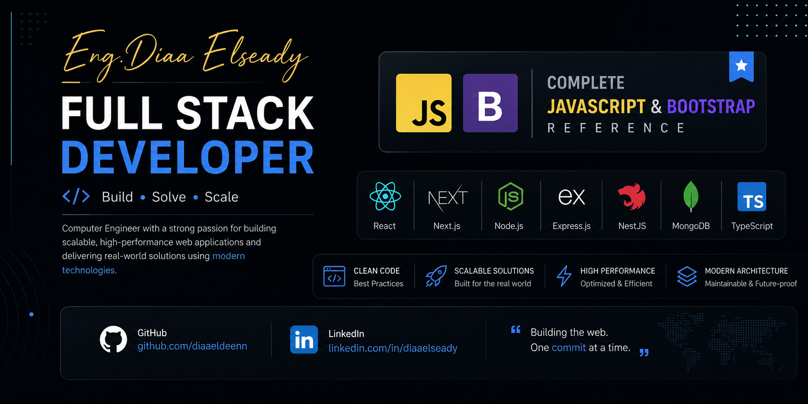

<p align="center">
  
</p>

<h1 align="center">📚 JavaScript & Bootstrap Complete Reference Guide</h1>

<p align="center">
A complete JavaScript & Bootstrap reference designed to take you from the fundamentals to advanced concepts with practical examples, interview-focused explanations, and real-world best practices.
</p>

<p align="center">
  <a href="https://github.com/diaaeldeenn">
    
  </a>
  <a href="https://linkedin.com/in/diaaelseady">
    
  </a>
</p>

<p align="center">


</p>

---

# 👋 About

Hi, I'm **Eng. Diaa Elseady**, a **Full Stack Developer** specializing in:

- React.js
- Next.js
- Node.js
- Express.js
- NestJS
- MongoDB
- TypeScript

This repository was created to serve as a structured JavaScript & Bootstrap reference that combines fundamentals, advanced concepts, interview questions, and practical examples in one place.

Whether you're learning JavaScript for the first time or preparing for technical interviews, this guide is designed to help.

---

# ✨ Features

- 📖 Complete learning path
- 💻 Hundreds of code examples
- 🎯 Interview-focused explanations
- ⚡ Modern JavaScript (ES6+)
- 🧠 Advanced concepts explained simply
- 🔥 Best practices
- 📌 Common pitfalls
- 🚀 Beginner-friendly structure

---

# 📚 Sessions

| # |                            Session                     |          Level        | Status |
|---|--------------------------------------------------------|-----------------------|--------|
| 01 | [Fundamentals](./sessions/session-01-fundamentals.md) | 🟢 Beginner            | ✅ |
| 02 | [Core Concepts](./sessions/session-02-core-concepts.md) | 🟢 Beginner          | ✅ |
| 03 | [DOM & Events](./sessions/session-03-dom-events.md) | 🟡 Intermediate          | ✅ |
| 04 | [API & AJAX](./sessions/session-04-api-ajax.md) | 🟡 Intermediate              | ✅ |
| 05 | [Async JavaScript](./sessions/session-05-async-javascript.md) | 🔵 Advanced    | ✅ |
| 06 | [Modern JavaScript](./sessions/session-06-modern-javascript.md) | 🔵 Advanced  | ✅ |
| 07 | [Object-Oriented Programming](./sessions/session-07-oop.md) | 🔴 Advanced      | ✅ |
| 08 | [Bootstrap 5](./sessions/session-08-bootstrap.md) | 🟢 Beginner | ✅ |

---

# 📖 Topics Covered

<details>

<summary><b>Click to Expand</b></summary>

## Session 01 — Fundamentals

- Variables
- Data Types
- Operators
- Conditionals
- Type Conversion
- Comparison Operators

---

## Session 02 — Core Concepts

- Loops
- Functions
- Arrays
- Objects
- Array Methods

---

## Session 03 — DOM & Events

- DOM Manipulation
- Event Listeners
- Forms
- Event Bubbling
- Event Capturing

---

## Session 04 — API & AJAX

- HTTP Methods
- XMLHttpRequest
- Fetch API
- JSON
- Status Codes
- Postman

---

## Session 05 — Async JavaScript

- Event Loop
- Callbacks
- Promises
- Async / Await
- Fetch

---

## Session 06 — Modern JavaScript

- ES6+
- Destructuring
- Spread Operator
- Rest Operator
- Optional Chaining
- Nullish Coalescing
- Closures
- Debouncing
- Throttling
- this
- call
- apply
- bind

---

## Session 07 — OOP

- Constructor Functions
- Prototype
- Prototype Chain
- Classes
- Inheritance
- Encapsulation
- Abstraction
- Polymorphism
- Getters & Setters
- Static Methods
- Composition

---

## Session 08 — Bootstrap 5

- Installation
- Containers
- Grid System
- Display Utilities
- Colors System
- Buttons
- Forms
- Navbar
- Cards
- Carousel
- Modal
- Navs & Tabs
- ScrollSpy
- Icons
- Common Utilities

</details>

---

# 💡 Interview Questions Covered

- Hoisting
- TDZ
- var vs let vs const
- Closures
- Scope Chain
- Event Loop
- Promise vs Async/Await
- this keyword
- call / apply / bind
- Prototype Chain
- Shallow vs Deep Copy
- Debouncing
- Throttling
- Auto Boxing
- typeof null
- Memory Management
- Execution Context
- And many more...

---

# 🎯 Who Is This Guide For?

✅ Beginners

✅ Frontend Developers

✅ Backend Developers

✅ Full Stack Developers

✅ Students

✅ Self-learners

✅ Interview Preparation

---

# 🚀 How to Use

1. Read the sessions in order.
2. Type every code example yourself.
3. Experiment with the examples.
4. Build small projects after every section.
5. Review the interview questions.

---

# 📂 Repository Structure

```text
📦 JavaScript-Complete-Reference-Guide

├── assets/
│   └── banner.png
│
├── sessions/
│   ├── session-01-fundamentals.md
│   ├── session-02-core-concepts.md
│   ├── session-03-dom-events.md
│   ├── session-04-api-ajax.md
│   ├── session-05-async-javascript.md
│   ├── session-06-modern-javascript.md
│   ├── session-07-oop.md
│   └── session-08-bootstrap.md
│
└── README.md
```

---

# 📈 Roadmap

- ✅ JavaScript Reference
- ✅ Bootstrap Reference
- 🚧 React Reference
- 🚧 TypeScript Reference
- 🚧 Next.js Reference
- 🚧 Node.js Reference
- 🚧 Express.js Reference
- 🚧 NestJS Reference
- 🚧 MongoDB Reference

---

# 🤝 Contributing

Contributions are always welcome!

If you'd like to improve this guide:

1. Fork the repository.
2. Create a new branch.
3. Commit your changes.
4. Open a Pull Request.

---

# 📄 License

This project is licensed under the **Creative Commons Attribution-NonCommercial-NoDerivatives 4.0 International License (CC BY-NC-ND 4.0)**.

## What Does This Mean?

You are **free to**:
- ✅ Share — copy and redistribute the material in any medium or format

Under the following terms:
- **Attribution** — You must give appropriate credit, provide a link to the license, and indicate if changes were made. You may do so in any reasonable manner, but not in any way that suggests the licensor endorses you or your use.
- **NonCommercial** — You may not use the material for commercial purposes.
- **NoDerivatives** — If you remix, transform, or build upon the material, you may not distribute the modified material.

**In simple terms:**
- ✅ You can view, download, and share this guide freely
- ✅ You must give credit to the author (Eng. Diaa Elseady)
- ❌ You cannot use this guide for commercial purposes
- ❌ You cannot modify or distribute modified versions

For full license details, see the [LICENSE](./LICENSE) file.

---

**For commercial use or other permissions, please contact me directly.**

---

# ⭐ Support

If you found this repository useful,

please consider giving it a **⭐ Star**.

It helps the project reach more developers and motivates me to continue creating free educational content.

---

# 🌐 Connect With Me

<p align="center">

<a href="https://linkedin.com/in/diaaelseady">

</a>

<a href="https://github.com/diaaeldeenn">

</a>

</p>

---

<p align="center">

### ❤️ Happy Coding!

**Made with passion by Eng. Diaa Elseady**

</p>
